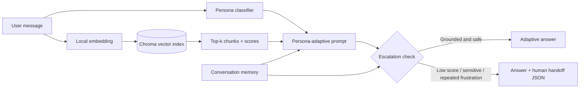

# Adsparkx Persona-Adaptive Support Agent

An end-to-end customer support agent that detects a customer's communication persona, retrieves grounded support content, changes its response style, and safely hands sensitive or unresolved cases to a human.

## Features

- Detects **Technical Expert**, **Frustrated User**, and **Business Executive** personas.
- Indexes Markdown, text, and PDF articles with source, section, and page metadata.
- Uses persistent ChromaDB cosine search with deterministic local embeddings; no model download is needed.
- Uses Gemini for structured persona classification and grounded adaptive generation when `GEMINI_API_KEY` is configured.
- Provides a transparent offline fallback for demos and local tests.
- Escalates low-confidence, sensitive, and repeatedly frustrating conversations.
- Produces a downloadable structured human-handoff record.
- Includes Streamlit chat and CLI interfaces plus automated tests.

## Architecture



The workflow is coordinated by `SupportAgent`. Retrieval and classification happen before generation. The same retrieved scores are exposed in the UI and used by the escalation policy, making the decision inspectable.

## Tech stack

| Component | Choice |
|---|---|
| Language | Python 3.11+ |
| UI | Streamlit 1.30+ |
| LLM | Gemini via `google-genai` 1.x |
| Vector database | ChromaDB 0.5+ |
| Embeddings | Local 768-dimensional feature hashing |
| PDF parsing | pypdf 5+ |
| Configuration | python-dotenv 1.x |
| Tests | pytest 8+ |

Local feature-hashing embeddings were chosen to keep ingestion private, deterministic, free, and available offline. They map token and adjacent-token features into normalized vectors; Chroma performs cosine nearest-neighbor search. Gemini remains responsible for language understanding and answer quality when configured. A production extension could switch the embedding function to a neural embedding model without changing the agent workflow.

## Project structure

```text
.
├── app.py                    # Streamlit chat UI
├── cli.py                    # Interactive terminal UI
├── data/                     # 15 support documents, including a PDF
├── scripts/generate_pdf.py   # Reproducible PDF asset generator
├── src/
│   ├── agent.py              # Workflow orchestration and memory
│   ├── classifier.py         # Gemini + local persona classification
│   ├── config.py             # Environment-driven policy
│   ├── escalator.py          # Escalation and handoff logic
│   ├── generator.py          # Grounded persona-adaptive answers
│   ├── models.py             # Typed workflow data
│   └── rag_pipeline.py       # Parsing, chunking, index, retrieval
├── tests/
├── .env.example
└── requirements.txt
```

## Persona detection strategy

With a Gemini key, the classifier requests strict JSON containing the persona, confidence, and short reasoning at temperature 0. The prompt defines vocabulary, tone, and intent cues for each class. If Gemini is unavailable, a deterministic vocabulary-and-punctuation classifier keeps the application demonstrable. This fallback is explicitly identified in its reasoning output.

Response prompts then apply these styles:

- **Technical Expert:** root cause, exact configuration, and precise troubleshooting steps.
- **Frustrated User:** brief validation, plain language, and action-oriented steps.
- **Business Executive:** concise operational impact, documented timelines, and next action.

Every prompt directs Gemini to use only retrieved content and to acknowledge missing facts instead of inventing them.

## RAG pipeline

The loader reads `.md` and `.txt` files directly and extracts PDFs page-by-page. Text is grouped on paragraph boundaries into approximately 700-character chunks with 100-character overlap. Metadata records the source filename, section heading, and PDF page.

The local embedding function removes common stop words and hashes lowercase tokens and token bigrams into a normalized 768-dimensional vector. Chroma stores these embeddings persistently under `chroma_db/` and searches with cosine distance. The top three chunks are returned by default. Index IDs are content hashes, so unchanged documents are upserted rather than duplicated on startup.

## Escalation logic

Escalation is triggered when any of these conditions applies:

- no chunk is retrieved;
- the top retrieval score is below `RETRIEVAL_THRESHOLD`;
- the request includes a configured billing, legal, ownership, privacy, or account-sensitive phrase;
- repeated frustrated messages reach `FRUSTRATION_TURN_LIMIT`.

The handoff contains persona, issue, recent conversation, source documents, confidence, detected attempted actions, reasons, and a recommended human next step. Sensitive cases are escalated even when relevant policy content is available—the content helps set expectations but does not authorize an automated account action.

## Setup

1. Create and activate a Python 3.11+ virtual environment.

   ```powershell
   py -3.11 -m venv .venv
   .venv\Scripts\Activate.ps1
   ```

2. Install dependencies.

   ```powershell
   python -m pip install -r requirements.txt
   ```

3. Copy `.env.example` to `.env`. Add a Gemini key for LLM-backed classification and generation. The app works in clearly labelled offline fallback mode without one.

4. Start the web app.

   ```powershell
   streamlit run app.py
   ```

   Or run the terminal version with `python cli.py`.

On first launch the app parses and indexes the knowledge base. Use **Rebuild knowledge index** in the sidebar after changing documents.

Python 3.11–3.13 is recommended for persistent Chroma storage. On Python 3.14, where Chroma's Windows native extension is not yet reliable, the project automatically uses the same embeddings with its in-memory cosine-search fallback.

## Environment variables

| Variable | Default | Purpose |
|---|---|---|
| `GEMINI_API_KEY` | empty | Enables Gemini classification and generation |
| `GEMINI_MODEL` | `gemini-2.5-flash` | Configurable Gemini model name |
| `DATA_DIR` | `data` | Knowledge-base directory |
| `CHROMA_DIR` | `chroma_db` | Persistent vector-index directory |
| `TOP_K` | `3` | Retrieved chunk count |
| `RETRIEVAL_THRESHOLD` | `0.12` | Minimum accepted top cosine similarity |
| `FRUSTRATION_TURN_LIMIT` | `2` | Frustrated turns before escalation |

Never commit `.env` or API keys. `.gitignore` excludes both local secrets and the generated vector index.

## Example queries

1. `What Authorization header and base URL should I use when the API returns 401?`
2. `I've cleared everything and the dashboard still won't load! This is urgent!`
3. `What is the operational impact and communication timeline during an outage?`
4. `Our PostgreSQL connector reports SCHEMA_DENIED. Which grants should I inspect?`
5. `I was charged twice and demand an immediate refund!` — demonstrates sensitive-case escalation.
6. Send two frustrated messages in one session — demonstrates multi-turn escalation.

## Testing

```powershell
pytest -q
```

The tests cover all three personas, sensitive billing escalation, and local knowledge retrieval. For a demo recording, show the project tree, index rebuild, one query per persona, five total queries, the refund escalation, and its downloadable JSON handoff.

## Known limitations and next steps

- Feature hashing is fast and private but less semantically rich than a neural embedding model.
- Rule fallback classification can miss subtle personas; Gemini mode is preferred for evaluation.
- Conversation state currently lives in the Streamlit process and is not shared across replicas.
- Gemini failures fall back locally but are not yet surfaced as operational telemetry.
- Production use should add authentication, encrypted ticket storage, PII redaction, audit logs, feedback analytics, and an actual help-desk handoff integration.
